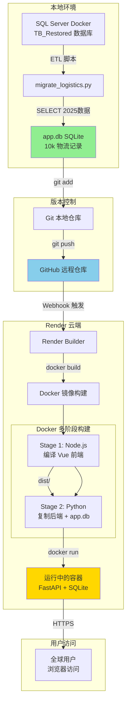

# 数据流程图

## 完整的数据旅程

## 关键节点说明

### 1. ETL 过程 (本地)
- **输入**: SQL Server 分区表 `TBOutCodeRelation25xxxx`
- **处理**: Python 脚本连接两个数据库,执行 JOIN 查询
- **输出**: `app.db` (单文件,10MB)

### 2. Git 版本控制
- **作用**: 不仅管理代码,也管理数据库文件
- **注意**: `.gitignore` 中**没有**排除 `app.db`

### 3. Docker 构建
- **阶段 1**: 用 Node.js 编译 Vue (生成静态文件)
- **阶段 2**: 用 Python 运行后端,同时服务前端静态文件

### 4. 数据持久化
- **问题**: Docker 容器重启后数据会丢失吗?
- **答**: 不会! `app.db` 被打包进**镜像**,每次启动都会恢复
- **但**: 如果在云端修改了数据,重新部署会覆盖 (因为镜像是只读的)
